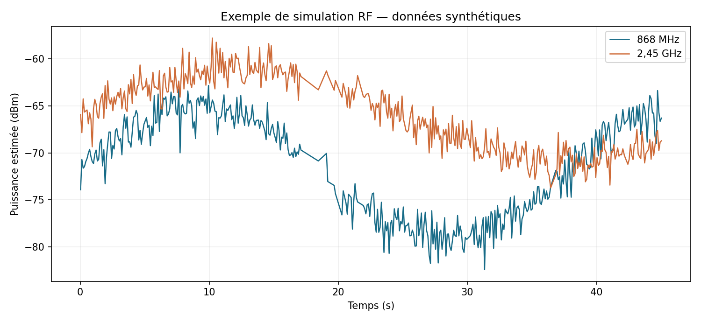

# Étude et réalisation d’un capteur d’onde électromagnétique

**Observer l’activité RF, visualiser les acquisitions et estimer leur évolution temporelle.**

Projet de Master 2 EEA réalisé à l’Institut d’Électronique et des Systèmes, Université de Montpellier.

**Auteur :** Abdoul Kalidou DIALLO  
**Encadrement :** Jean Podlecki  
**Stage :** avril–août 2026

## Découvrir le projet

- [Démonstration sans installation](docs/DEMONSTRATION.md)
- [Architecture et limites](docs/ARCHITECTURE.md)
- [Récupérer et contribuer au projet](docs/PUBLICATION.md)



*Exemple entièrement simulé : ces courbes ne constituent pas une mesure expérimentale.*

## Objectif

Étudier et réaliser un dispositif capable d’observer l’activité RF autour de 868 MHz et 2,45 GHz, d’en estimer le niveau et le suivi temporel, et d’exploiter certaines informations de communications sans fil.

La voie analogique associe antenne, filtrage, amplification, détection RF et conversion analogique-numérique. Une voie numérique complète cette approche par l’observation Wi-Fi et BLE.

## Fonctions du logiciel

| Source | Fonction | Prérequis |
|---|---|---|
| Simulation RF | Deux voies synthétiques pour découvrir l’interface | Python, Tkinter, Matplotlib |
| MCP3208 | Lecture SPI et conversion tension–puissance configurable | Raspberry Pi, ADC et chaîne RF calibrée |
| Wi-Fi | RSSI de la liaison courante | Linux, `iw`, interface connectée |
| BLE | RSSI et champs protocolaires disponibles | nRF Sniffer, tshark et extension configurée |

Interface graphique, acquisition limitée par durée ou nombre de mesures, graphiques et exports CSV/PNG. Le champ `simulated` permet de distinguer les données synthétiques des observations physiques.

## Essai sans matériel

Sur Linux avec une session graphique, Python 3.10+ et Tkinter disponibles :

```bash
python3 -m venv .venv
source .venv/bin/activate
python -m pip install -r requirements.txt
python src/main.py
```

Dans **Sources / Acquisition**, cocher uniquement **Simulation RF**, choisir **Durée limitée**, régler **30 secondes**, puis cliquer sur **Démarrer**. Les exports sont placés dans `src/exports/` et ignorés par Git.

Sur Debian/Ubuntu, les paquets `python3-venv` et `python3-tk` doivent être installés. Le mode simulation ne nécessite pas `spidev`, `iw` ni `tshark`.

## Organisation

| Chemin | Contenu |
|---|---|
| `src/main.py` | Application graphique et traitement |
| `src/drivers/` | Interfaces MCP3208, Wi-Fi et BLE |
| `examples/simulation/` | Exemple synthétique vérifié |
| `docs/` | Démonstration, architecture et publication |

## Compétences mobilisées

Instrumentation RF, bilan de gain, calibration, acquisition SPI, développement Python, interface Tkinter, communications Wi-Fi/BLE, traitement et traçabilité des données.

## Portée et validation

Prototype académique. Les résultats RF et RSSI dépendent de la calibration, du récepteur et des hypothèses temporelles. L’énergie estimée n’est pas une énergie absorbée par une personne. Les seuils colorés sont des repères logiciels ; ils ne constituent pas des seuils sanitaires.

Le code est issu de la version multimode du travail initial. Cette édition reprend une sélection de fichiers avec un nom de projet unifié. La démonstration simulée ne valide pas la précision du matériel. Voir les [limites détaillées](docs/ARCHITECTURE.md).

