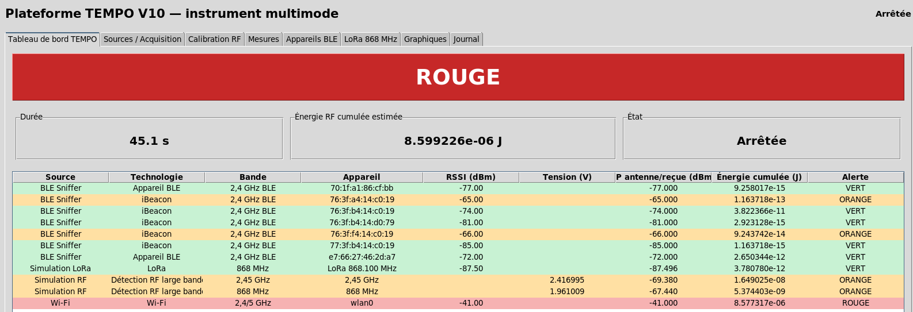
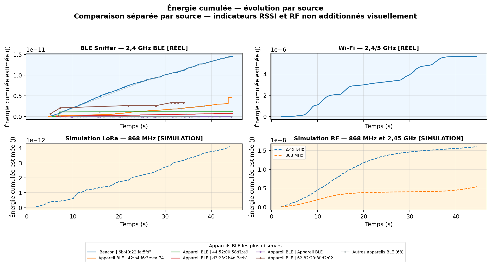
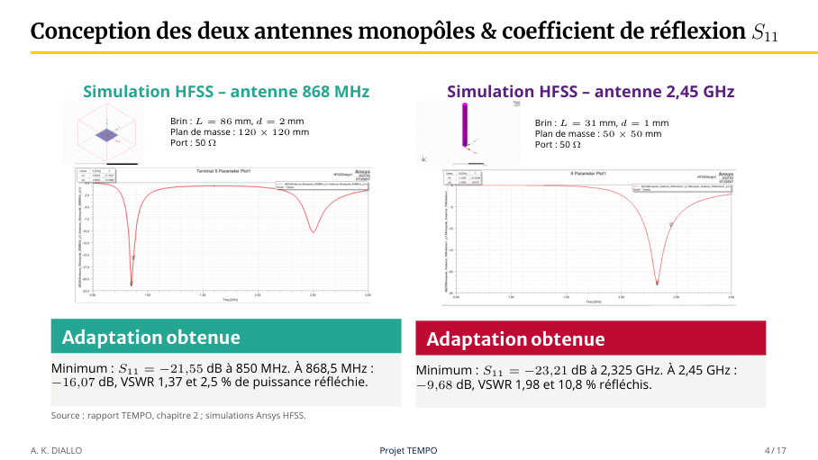

# Images de la plateforme et des résultats

[Accueil](../README.md) · [LoRa](LORA.md) · [Résultats simulés](RESULTATS_SIMULATION.md)

## Tableau de bord de la version de soutenance

Source : image extraite de la page 14 de la [présentation PDF](PRESENTATION_PFE_TEMPO_CEO.pdf#page=14). Le titre visible correspond à la version historique du logiciel.

Cette session combine Wi-Fi/BLE et RF/LoRa simulés. La valeur 8,599226 µJ visible dans le tableau est un cumul logiciel de sources hétérogènes ; elle n’est pas une mesure d’énergie absorbée ni une puissance calibrée. Elle ne correspond pas au CSV exclusivement simulé livré dans `examples/simulation/`.

L’interface historique possède un onglet LoRa. L’édition principale actuelle de `src/main.py` ne l’intègre pas encore ; l’extension indépendante est décrite dans [LoRa](LORA.md).

## Énergie cumulée multimode présentée à la soutenance

Source : illustration extraite de la page 15 du PDF, reproduite telle quelle. Les panneaux distinguent les observations Wi-Fi/BLE et les simulations RF/LoRa. Les échelles diffèrent selon les panneaux. Cette figure historique n’est pas reconstruite depuis le CSV de démonstration ; l’identité de session et la concordance de ses totaux avec le tableau de bord n’ont pas été vérifiées sur les données brutes.

## Énergie cumulée de l’exemple reproductible

Courbes calculées depuis [mesures.csv](../examples/simulation/mesures.csv) par cumul de `energy_j`, séparément pour chaque bande. Les 826 lignes sont simulées.

| Voie | Énergie finale calculée |
|---|---:|
| 868 MHz | 5,380 nJ |
| 2,45 GHz | 14,913 nJ |

Ces courbes reposent sur les durées enregistrées (0,1 s par contribution). Elles ne reconstituent pas une intégration continue sur tous les intervalles observés. Voir les [résultats et limites temporelles](RESULTATS_SIMULATION.md).

## Onglet LoRa historique

Source : page 25 du PDF. Il s’agit de données simulées ; la réception radio avec un module réel reste à valider.

## Chaîne RF et composants

Les [fiches composants et illustrations techniques](composants/README.md) regroupent les filtres, le LNA, le détecteur et le MCP3208.

## Antennes étudiées sous HFSS

Source : présentation, page 4. Ces images et valeurs sont rapportées depuis le document de projet ; les modèles HFSS natifs ne sont pas inclus.
