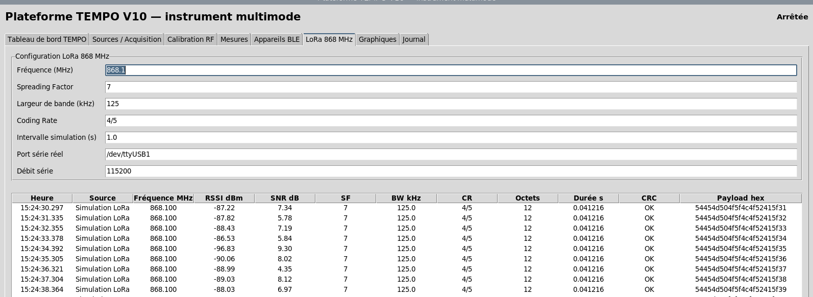

# LoRa 868 MHz

[Accueil](../README.md) · [Galerie](GALERIE.md)

## Partie réalisée et statut

La présentation de soutenance décrit une source LoRa **simulée**, une configuration radio, un tableau de paquets et des exports. Elle indique explicitement que la réception avec un module réel reste à valider (page 25 du [PDF](PRESENTATION_PFE_TEMPO_CEO.pdf#page=25)).



*Capture extraite du PDF, page 25. Les lignes affichées portent « Simulation LoRa ». Cette capture montre une version de soutenance ; l’onglet n’est pas encore porté dans `src/main.py` de cette édition.*

## Code ajouté dans ce dépôt

Le dossier [extensions/lora](../extensions/lora/) reprend le pilote LoRa du travail initial et fournit une démonstration indépendante. Il contient :

- `LoRaPacket` : structure d’un paquet ;
- `LoRaSimulationDriver` : production de paquets synthétiques ;
- `LoRaSerialJSONDriver` : lecture de lignes JSON depuis un port série ;
- `time_on_air_seconds` : estimation de durée selon les hypothèses du code ;
- `demo.py` : affichage JSON en terminal, avec un marqueur `simulated`.

Ces éléments enrichissent le dépôt sans remplacer l’application graphique existante.

## Essayer sans matériel

Depuis la racine :

```bash
python extensions/lora/demo.py --count 5
```

La sortie standard contient cinq objets JSON, chacun marqué `simulated: true`. Les messages d’état sont écrits sur la sortie d’erreur. Aucun signal radio n’est émis : le programme génère des données synthétiques.

Les niveaux RSSI/SNR varient aléatoirement. Ce test valide la circulation des données dans l’extension, pas une réception à 868 MHz.

## Réception par port série

Après installation de la dépendance :

```bash
python -m pip install -r extensions/lora/requirements.txt
python extensions/lora/demo.py --serial-port /dev/ttyUSB1 --baudrate 115200 --count 5
```

Le périphérique doit fournir **un objet JSON par ligne**, par exemple :

```json
{"frequency_mhz":868.1,"rssi_dbm":-83,"snr_db":7.5,"sf":7,"bw_khz":125,"cr":"4/5","length":5,"crc_ok":true,"payload_hex":"48454c4c4f"}
```

Ceci est un exemple synthétique de format, pas un paquet reçu. La marque `simulated: false` indique ici l’utilisation du port série ; elle ne prouve pas que le périphérique produit de vraies mesures RF. Vérifier sa provenance et son firmware. Aucun firmware de réception radio validé n’est fourni.

## Paramètres de l’exemple de soutenance

| Paramètre | Valeur rapportée dans le PDF |
|---|---:|
| Fréquence | 868,1 MHz |
| Facteur d’étalement SF | 7 |
| Largeur de bande | 125 kHz |
| Codage | 4/5 |
| Charge utile | 12 octets |
| Durée estimée | 41,216 ms |
| Nombre de messages de la session | 44, simulés |

Le calcul du pilote retrouve 41,216 ms pour ces paramètres. Il suppose notamment un préambule de 8 symboles, un en-tête explicite et un CRC activé. Il simplifie l’optimisation bas débit ; ne pas l’utiliser comme calculateur universel sans vérifier ces hypothèses pour le module et la configuration choisis.

## Limites

La chaîne RF analogique à 868 MHz observe un niveau d’énergie et ne décode pas les paquets LoRa. Le pilote série dépend d’un récepteur externe. Le booléen CRC et les champs radio proviennent du JSON fourni par ce périphérique, et ne sont pas recalculés par l’application.

Cette extension ne fournit pas une intégration LoRaWAN, ni une campagne de mesures physiques. L’intégration de l’onglet dans l’application publiée et la validation du module réel restent à effectuer.

