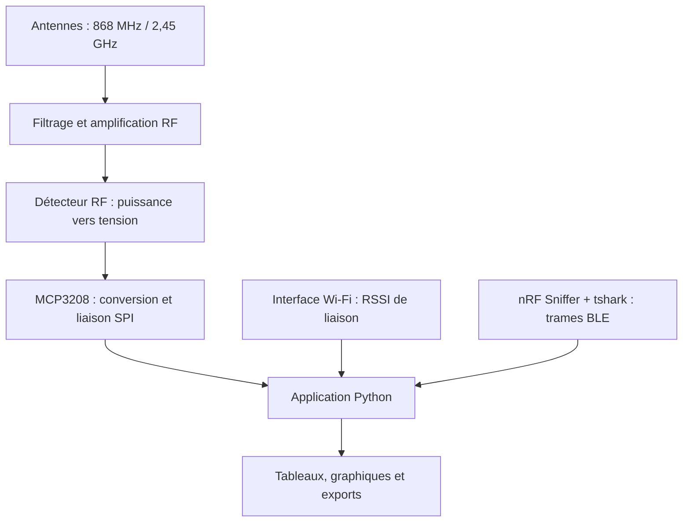

# Matériel et chaîne d’acquisition

[Accueil](../README.md) · [Calibration](CALIBRATION.md) · [Antennes](ANTENNES.md)

## Architecture fonctionnelle

Ce schéma décrit les fonctions. Il ne constitue ni un schéma de câblage ni une preuve de réalisation de deux voies physiques simultanées.

## Rôle des éléments

| Élément | Fonction | Point à documenter sur le montage |
|---|---|---|
| Antenne | Coupler le signal reçu au circuit RF | Bande, adaptation, connecteur, orientation |
| Filtre | Sélectionner une bande | Réponse fréquentielle et pertes d’insertion |
| LNA | Amplifier le signal avant détection | Gain selon la fréquence, dynamique et alimentation |
| Détecteur RF | Produire une tension exploitable | Loi tension–puissance et domaine calibré |
| MCP3208 | Numériser la tension via SPI | VREF mesurée, canal, câblage et masse |
| Raspberry Pi | Piloter l’acquisition et l’affichage | OS, Python, droits SPI et interfaces |
| Sniffer BLE | Fournir des observations protocolaires | Version du sniffer, champs tshark disponibles |

Les références commerciales et les illustrations de la présentation sont regroupées dans les [documents composants](composants/README.md). Le schéma électrique définitif et les photographies du montage final restent à joindre. Les caractéristiques nominales d’un composant ne remplacent pas sa caractérisation dans la chaîne assemblée.

## Configuration présente dans le logiciel

| Paramètre | Valeur initiale | Signification |
|---|---|---|
| Canal ADC de la voie 868 MHz | 0 | Choix logiciel à adapter au câblage |
| Canal ADC de la voie 2,45 GHz | 1 | Choix logiciel à adapter au câblage |
| Bus / périphérique SPI | 0 / 0 | Configuration initiale |
| VREF | 3,3 V | Valeur saisie ; vérifier la valeur réelle |
| Période | 100 ms | Consigne logicielle, pas cadence garantie |
| Interface Wi-Fi | wlan0 | À remplacer si nécessaire |

Ces valeurs proviennent de `src/main.py`. Elles ne garantissent pas la compatibilité électrique d’un montage. Vérifier les brochages et tensions avec les documents des composants effectivement utilisés avant raccordement.

## Préparation d’une session physique

1. Relever les références, alimentations, connexions et instruments de référence.
2. Confirmer le câblage, les niveaux électriques et la référence de tension.
3. Vérifier séparément l’accès SPI, le Wi-Fi connecté ou le sniffer BLE.
4. Saisir les paramètres calibrés de chaque voie.
5. Désactiver Simulation RF et activer uniquement les sources nécessaires.
6. Archiver les réglages avec les exports et la [fiche d’essai](templates/FICHE_ESSAI.md).

Un niveau RF mesuré par la chaîne analogique ne suffit pas à identifier un protocole. Une identification BLE issue du pilote reste indicative.

