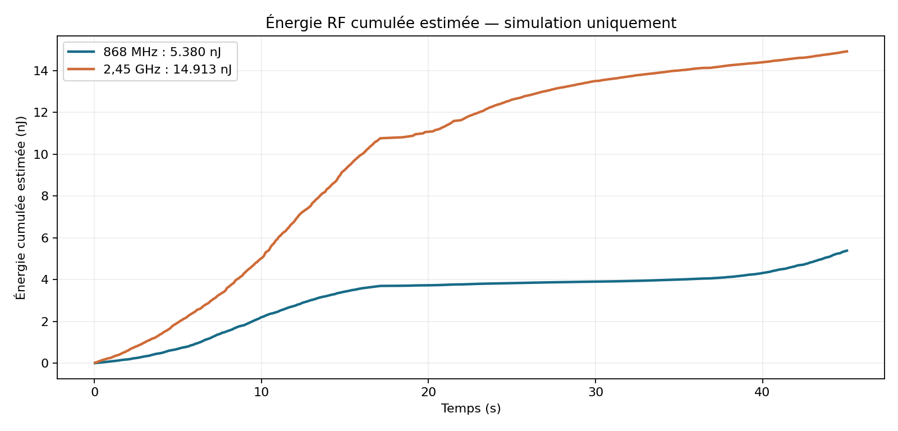

# Résultats de l’exemple simulé

[Accueil](../README.md) · [Données](DONNEES.md) · [Démonstration](DEMONSTRATION.md)

## Provenance et reproduction

Source : [mesures.csv](../examples/simulation/mesures.csv), session synthétique reprise de l’application multimode. Les 826 enregistrements portent `simulated=True` et `source=Simulation RF`. Aucune mesure physique n’est présentée dans cette page.

Commande exécutée depuis la racine :

```bash
python scripts/analyse_simulation.py
```

## Résumé par voie

| Indicateur | 868 MHz | 2,45 GHz |
|---|---:|---:|
| Nombre d’enregistrements | 413 | 413 |
| Temps entre premier et dernier point | 45,025 s | 45,025 s |
| Somme des durées de calcul | 41,3 s | 41,3 s |
| Puissance minimale | −82,41 dBm | −73,71 dBm |
| Puissance maximale | −62,83 dBm | −57,79 dBm |
| Puissance moyenne linéaire | 0,1303 nW | 0,3611 nW |
| Moyenne linéaire reconvertie en dBm | −68,85 dBm | −64,42 dBm |
| Énergie estimée par somme des contributions | 5,380 nJ | 14,913 nJ |

Les moyennes utilisent des poids égaux par point. Les nombres affichés sont arrondis ; le script fournit les valeurs non arrondies.


## Énergie cumulée par bande



La figure cumule les contributions `energy_j` du CSV par bande. [Galerie et provenance des autres images](GALERIE.md).

## Ce que cet exemple montre

La chaîne logicielle sait représenter deux voies, conserver les données et calculer des indicateurs par voie. Le signal simulé combine une évolution périodique et une composante aléatoire.

**L’intervalle observé et la somme des durées ne coïncident pas.** Chaque ligne utilise 0,1 s pour son énergie ; 413 contributions donnent 41,3 s. Le temps entre le premier et le dernier point vaut environ 45,025 s. Ces définitions diffèrent aussi par le comptage des points et des intervalles. Le CSV seul ne permet pas d’attribuer tout l’écart à une cause précise.

L’énergie publiée est donc la somme des contributions enregistrées ; elle ne reconstitue pas une intégration rigoureuse sur tout le temps observé. Il faudrait définir une méthode d’intégration avec les horodatages et le traitement des intervalles manquants pour cela.

## Vérifications réalisées

- Lecture et résumé des 826 lignes.
- Vérification du marqueur de simulation sur chaque ligne.
- Contrôle de valeurs finies, de temps croissants par voie et de la cohérence `energy_j = power_w × duration_s`.
- Refus testé sur quatre entrées invalides : donnée réelle, NaN, énergie incohérente et temps négatif.

Ces contrôles portent sur l’exemple et l’utilitaire d’analyse. Ils ne valident pas le fonctionnement matériel, l’interface graphique ni la justesse métrologique de l’application.

