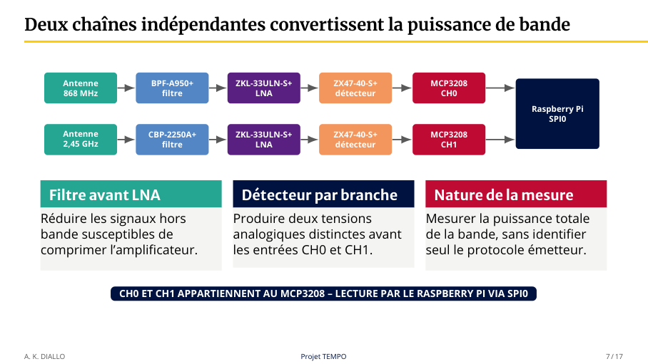
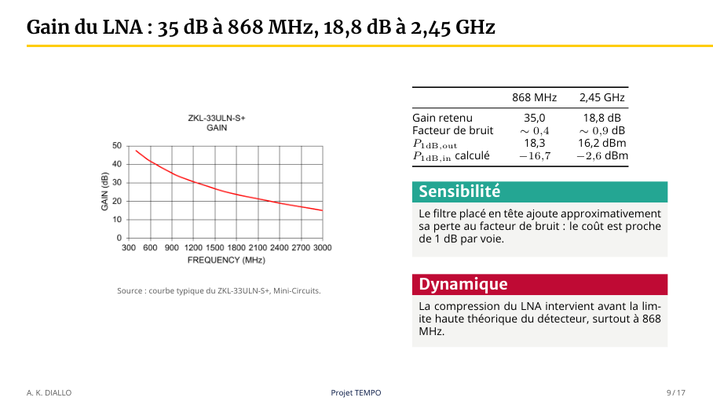
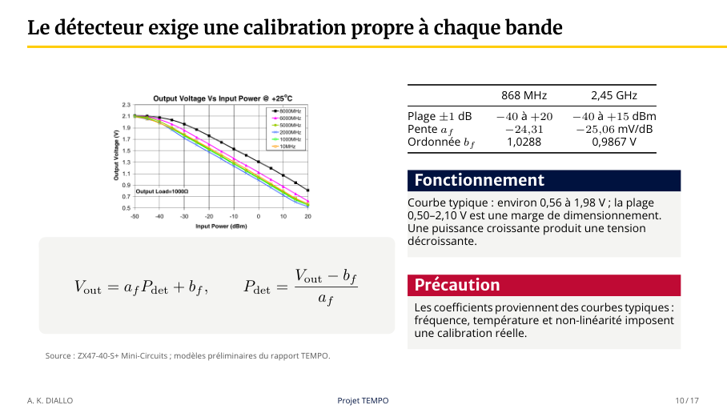
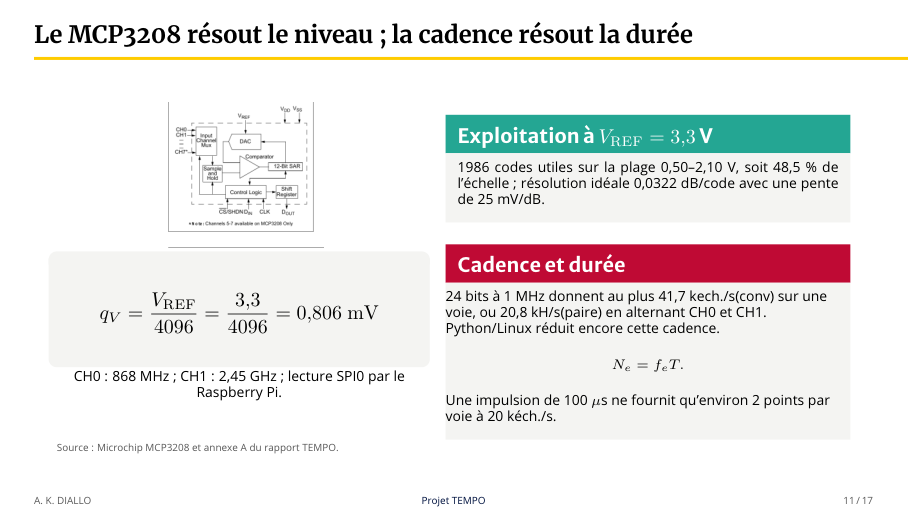

# Composants : fiches techniques et illustrations

[Accueil](../../README.md) · [Chaîne matérielle](../MATERIEL.md) · [Galerie](../GALERIE.md)

Les références ci-dessous sont celles indiquées dans la présentation du projet, pages 7 à 11. Elles décrivent la chaîne étudiée et dimensionnée ; elles ne prouvent pas l’assemblage ou la calibration finale du montage.

## Documentation constructeur

| Référence | Fonction dans le projet | Documentation |
|---|---|---|
| BPF-A950+ | Filtre de la voie 868 MHz | [Fiche Mini-Circuits](https://www.minicircuits.com/pdfs/BPF-A950%2B.pdf) |
| CBP-2250A+ | Filtre de la voie 2,45 GHz | [Fiche Mini-Circuits](https://www.minicircuits.com/pdfs/CBP-2250A%2B.pdf) |
| ZKL-33ULN-S+ | Amplification RF | [Fiche Mini-Circuits](https://www.minicircuits.com/pdfs/ZKL-33ULN-S%2B.pdf) |
| ZX47-40-S+ | Détecteur RF logarithmique | [Fiche de la famille ZX47-40](https://www.minicircuits.com/pdfs/ZX47-40%2B.pdf) |
| MCP3208 | Conversion analogique-numérique et liaison SPI | [Copie PDF Microchip DS21298E](MCP3204-MCP3208.pdf) · [Page constructeur](https://www.microchip.com/en-us/product/mcp3208) |

Sources vérifiées le 25 septembre 2026. La fiche ZX47-40 présente notamment les variantes SMA ZX47-40-S+ et ZX47-40LN-S+ : ne pas les confondre. La fiche Microchip regroupe MCP3204 et MCP3208 ; utiliser les informations et brochages correspondant au MCP3208 et au boîtier choisi.

Les quatre fiches Mini-Circuits sont accessibles par les liens officiels ; aucune copie locale n’est incluse, le téléchargement automatique ayant été refusé. La copie Microchip a été téléchargée depuis https://ww1.microchip.com/downloads/en/DeviceDoc/21298e.pdf. Il s’agit d’une révision archivée ; consulter le constructeur pour les révisions et errata ultérieurs. Les documents restent la propriété de leurs éditeurs.

## Architecture retenue

Source : rendu de la page 7 de la [présentation](../PRESENTATION_PFE_TEMPO_CEO.pdf#page=7). Le diagramme est fonctionnel ; il ne remplace pas un schéma électrique avec alimentations et brochages.

## Amplificateur RF

Source : présentation, page 9. Les valeurs sont celles retenues dans le document de projet, pas de nouvelles mesures réalisées pour ce dépôt.

## Détecteur logarithmique

Source : présentation, page 10. Les coefficients issus de courbes typiques nécessitent une calibration de chaque voie réelle.

## Conversion et acquisition

Source : présentation, page 11. Les limites théoriques de cadence ne sont pas une cadence validée sous Python/Linux.

## Comment exploiter les fiches

Avant le câblage, relever l’alimentation, les valeurs limites, le brochage et le boîtier. Pour le bilan RF, relever gain, pertes et dynamique à la fréquence utilisée. Pour la conversion, documenter VREF et le transfert tension–code. Séparer les caractéristiques garanties, les courbes typiques et les mesures de votre montage.

Le projet possède encore des réglages logiciels préliminaires : une valeur affichée dans le programme n’est pas automatiquement la valeur de la fiche ni celle du montage réel. Voir [Calibration](../CALIBRATION.md).
